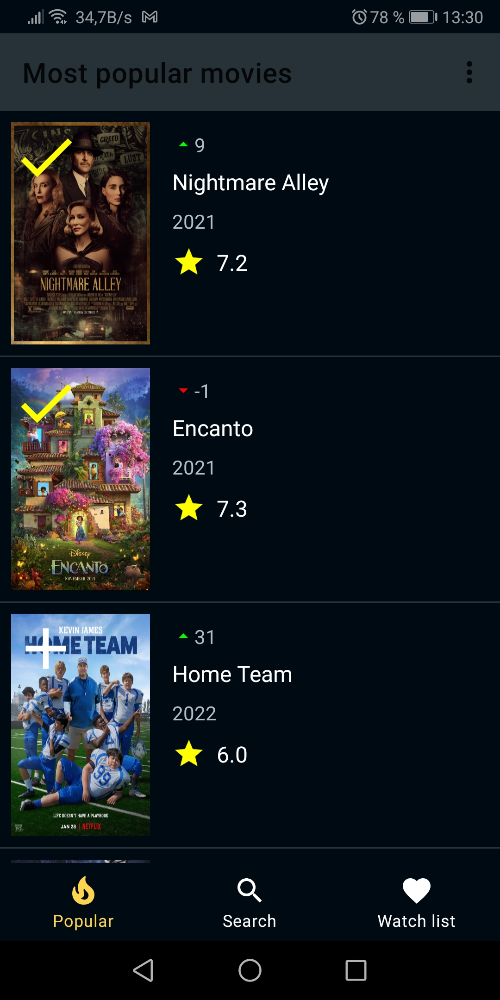
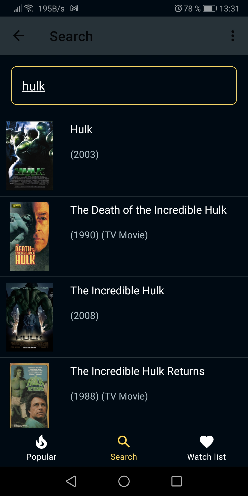
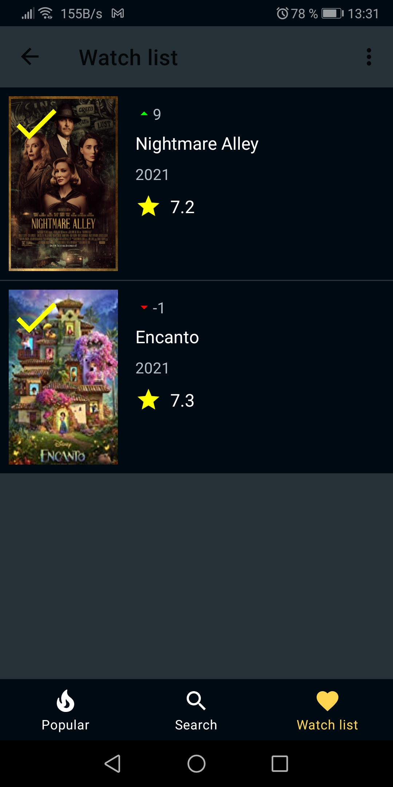
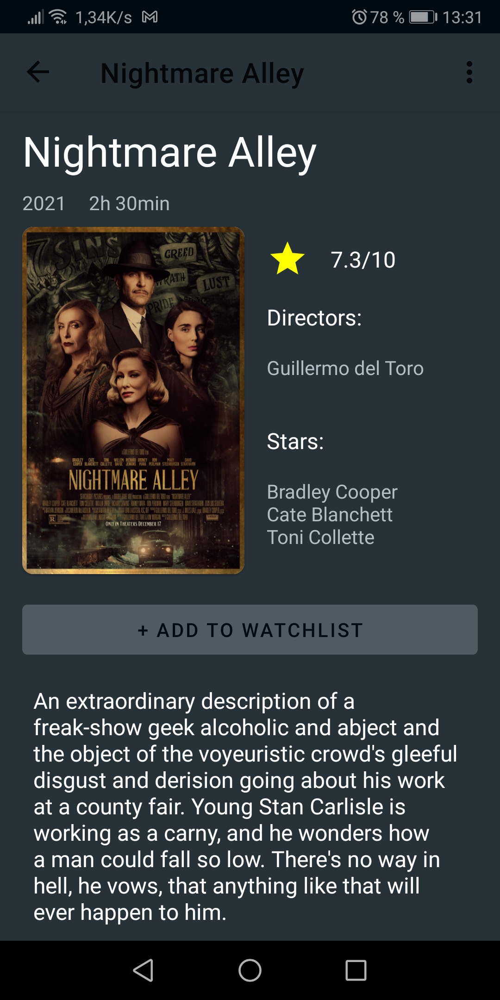

# MoviesApp
Simple project for testing api [IMDB API](https://imdb-api.com)

### Screens:

* Most popular movies screen 
The most popular movies according to IMDB, add them to your favorites if needed(Room database).

* Search screen 
To search movies by title

* Watchlist screen 
* Movies saved to database

* Detail screen 
Screen with certain movie. Screen has additional information about the movie, it is also possible to add the movie to favorites. 

### Architecture
* MVVM 
* Kotlin - 100%
### Libraries
* Retrofit2 & OkHttp3
    * [Converter: Gson](https://mvnrepository.com/artifact/com.squareup.retrofit2/converter-gson)
    * [Retrofit](https://mvnrepository.com/artifact/com.squareup.retrofit2/retrofit)
    * [OkHttp Logging Interceptor](https://mvnrepository.com/artifact/com.squareup.okhttp3/logging-interceptor)
* Navigation component
    * [Navigation Fragment KTX](https://mvnrepository.com/artifact/androidx.navigation/navigation-fragment-ktx)
    * [Navigation UI KTX](https://mvnrepository.com/artifact/androidx.navigation/navigation-ui-ktx)
* Room
    * [Android Room Runtime](https://mvnrepository.com/artifact/androidx.room/room-runtime)
    * [Android Room Kotlin Extensions](https://mvnrepository.com/artifact/androidx.room/room-ktx)
    * [Android Room Compiler](https://mvnrepository.com/artifact/androidx.room/room-compiler)
* Glide
    * [Glide](https://mvnrepository.com/artifact/com.github.bumptech.glide/glide)
* Timber
    * [Timber](https://mvnrepository.com/artifact/com.jakewharton.timber/timber)
* Dagger2
    * [Dagger](https://mvnrepository.com/artifact/com.google.dagger/dagger)
    * [Dagger Compiler](https://mvnrepository.com/artifact/com.squareup.dagger/dagger-compiler)
